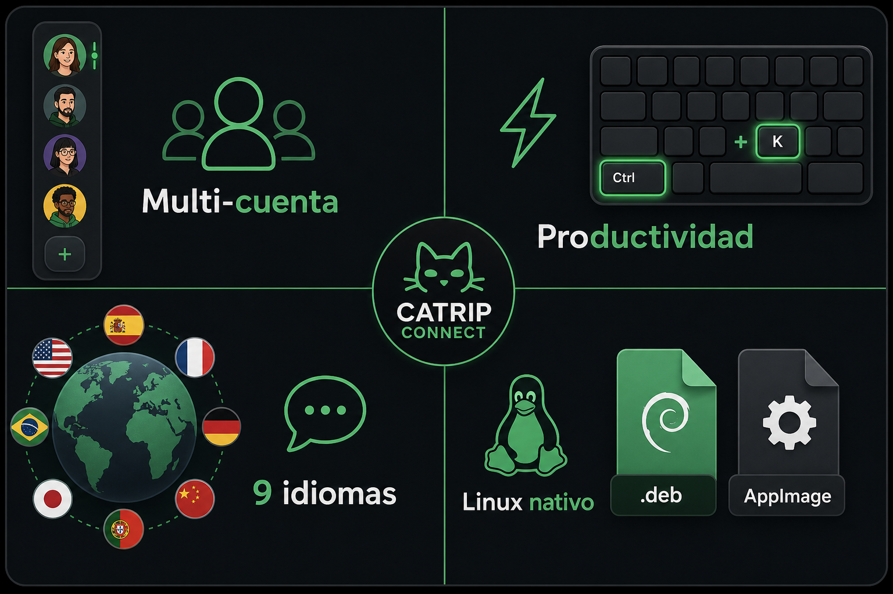
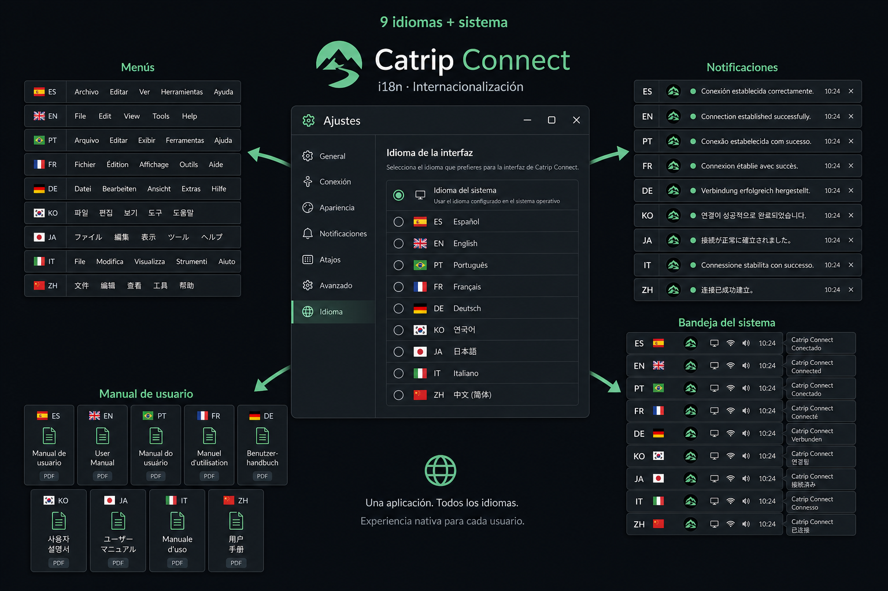

<p align="center">
  
</p>

<h1 align="center">Catrip Connect</h1>

<p align="center">
  <strong>Todas tus cuentas de WhatsApp Web, en un solo escritorio Linux.</strong><br/>
  Sesiones aisladas · atajos globales · 9 idiomas · listo para producción.
</p>

<p align="center">
  <a href="https://github.com/alktrip/catrip-multichat-electron/releases/latest">
    
  </a>
  <a href="https://github.com/alktrip/catrip-multichat-electron/actions/workflows/ci.yml">
    
  </a>
  
  
</p>

<p align="center">
  <a href="https://github.com/alktrip/catrip-multichat-electron/releases/latest"><strong>Descargar última versión</strong></a>
  ·
  <a href="USAGE.md">Guía de uso</a>
  ·
  <a href="docs/FLATPAK.md">Flatpak</a>
  ·
  <a href="CHANGELOG.md">Novedades</a>
</p>

---

## ¿Por qué Catrip Connect?

**Catrip Connect** es el cliente de escritorio oficial para quien trabaja con **varias cuentas de WhatsApp** en Linux: personal, soporte, ventas o equipos. Cada cuenta vive en su **propia sesión aislada** (cookies y datos separados), con una interfaz pensada para el día a día: cambio rápido entre perfiles, bandeja unificada de pendientes, centro de actividad y atajos que **siguen funcionando aunque estés escribiendo en un chat**.

No sustituye a WhatsApp: embebe **WhatsApp Web oficial** con las garantías de sesión que ya conoces (código QR, cifrado de extremo a extremo del servicio de Meta). Catrip añade la capa de **productividad en el escritorio** que el navegador no ofrece.

| Para quién                   | Qué obtienes                                                                 |
| ---------------------------- | ---------------------------------------------------------------------------- |
| **Profesional multi-cuenta** | Rail de avatares, `Ctrl+1`–`9`, reposo de cuentas inactivas para ahorrar RAM |
| **Equipos en Linux**         | `.deb`, **AppImage** y **Flatpak** (build local / Flathub pendiente), protocolo `whatsapp://`, bandeja del sistema |
| **Usuarios internacionales** | Interfaz en **9 idiomas** + idioma del sistema; manual integrado traducido   |
| **Flujo intensivo**          | Paleta `Ctrl+K`, «Ahora mismo», acciones pendientes, modo Zen                |

> **Versión actual: [1.7.0](https://github.com/alktrip/catrip-multichat-electron/releases/tag/v1.7.0)** — internacionalización completa, manual multilingüe, atajos con foco en WhatsApp Web y bandeja «Ahora mismo» unificada.

---

## Capturas y funciones destacadas

<p align="center">
  
</p>

### Organización de la ventana

El **rail** concentra cuentas y accesos rápidos; el área principal muestra WhatsApp Web de la cuenta activa.


- **Rail (izquierda):** avatares, contadores de no leídos, ⚡ Ahora mismo, ✉ pendientes, ▤ actividad, ajustes y modo Zen.
- **Área principal:** WhatsApp Web con sesión independiente por cuenta.
- **Cambio de cuenta:** un clic en el avatar o `Ctrl+1` … `Ctrl+9` según el orden del rail.

### Atajos que no pierden el foco

Los atajos de Catrip se interceptan en el proceso principal: **`Ctrl+K`**, **`Ctrl+P`**, **`Ctrl+U`**, **`Ctrl+Shift+A`**, **`F5`**, etc. funcionan **aunque el cursor esté en el campo de mensaje** de WhatsApp Web.


| Atajo               | Acción                                                 |
| ------------------- | ------------------------------------------------------ |
| `Ctrl+K`            | Paleta de comandos (cuentas, chats sin leer, acciones) |
| `Ctrl+P`            | Ajustes                                                |
| `Ctrl+1` … `Ctrl+9` | Cambiar a la cuenta en esa posición                    |
| `Ctrl+U`            | Nueva cuenta                                           |
| `Ctrl+Shift+A`      | Ahora mismo (chats más urgentes)                       |
| `Ctrl+Shift+Z`      | Modo Zen                                               |
| `F5`                | Recargar WhatsApp Web                                  |

Lista completa en la app: **Ayuda → Atajos de teclado** y en **[USAGE.md](USAGE.md)**.

### Nueve idiomas, una sola aplicación

Menús, notificaciones, bandeja, diálogos y **manual de usuario** traducidos. Por defecto: **idioma del sistema**; si no está soportado → **inglés**. WhatsApp Web conserva su propio idioma (configurable dentro de WhatsApp).



| Idioma       | Código |
| ------------ | ------ |
| Español      | `es`   |
| English      | `en`   |
| Português    | `pt`   |
| Français     | `fr`   |
| Deutsch      | `de`   |
| 한국어       | `ko`   |
| 日本語       | `ja`   |
| Italiano     | `it`   |
| 中文（简体） | `zh`   |

Configuración: **Ajustes → General → Idioma de la interfaz**.

---

## Descarga e instalación (Linux)

Artefactos oficiales en **[Releases de GitHub](https://github.com/alktrip/catrip-multichat-electron/releases/latest)** (versión **1.7.0**):

| Formato                                | Uso recomendado                                                                                            |
| -------------------------------------- | ---------------------------------------------------------------------------------------------------------- |
| **`catrip-connect_*_amd64.deb`**       | Integración en Debian/Ubuntu: menú, iconos, protocolo `whatsapp://`, actualizaciones avisadas desde la app |
| **`catrip-connect_*_x86_64.AppImage`** | Portable, sin instalación; ideal para probar o llevar en USB                                               |
| **Flatpak** (`com.catrip.catrip-multichat-electron`) | Sandbox, actualizaciones vía `flatpak update`; build local documentado en **[docs/FLATPAK.md](docs/FLATPAK.md)** — **aún no en Releases oficiales** |

> **Coexistencia:** no instales a la vez el **`.deb`** y el **Flatpak** si quieres un único lanzador en el menú. El `.deb` usa `catrip-connect.desktop`; el Flatpak usa `com.catrip.catrip-multichat-electron.desktop`. Los datos de usuario siguen en `~/.config/catrip_multichat_electron/` (mismo identificador interno).

### Instalación rápida (.deb)

```bash
# Tras descargar el .deb desde GitHub Releases:
sudo apt install ./catrip-connect_1.7.0_amd64.deb
catrip-connect
```

Dependencias habituales las resuelve `apt` (`libgtk-3-0`, `libnotify4`, `libnss3`, …; recomendable `libappindicator3-1` para la bandeja).

### Instalación rápida (AppImage)

```bash
chmod +x catrip-connect_1.7.0_x86_64.AppImage
./catrip-connect_1.7.0_x86_64.AppImage
```

Integrar en el menú del escritorio (opcional):

```bash
_scripts/install-appimage.sh release/catrip-connect_1.7.0_x86_64.AppImage
```

Si FUSE no está disponible: `./catrip-connect_1.7.0_x86_64.AppImage --appimage-extract-and-run`  
En Ubuntu 24+: `sudo apt install libfuse2t64` si el AppImage no monta.

### Primer arranque

1. Abre **Catrip Connect** desde el menú o terminal.
2. Crea la **primera cuenta** (botón «Nueva cuenta» o `Ctrl+U`).
3. Escanea el **código QR** en WhatsApp Web como en el navegador.
4. Añade más cuentas desde el rail o la paleta (`Ctrl+K` → «Nueva cuenta»).

Desinstalar paquete `.deb`:

```bash
sudo apt remove catrip-multichat-electron
```

### Flatpak (build local / desarrollo)

Requisitos y pasos completos en **[docs/FLATPAK.md](docs/FLATPAK.md)**. Resumen:

```bash
sudo apt install flatpak flatpak-builder python3-pil python3-venv
flatpak install flathub org.freedesktop.Platform//24.08 org.freedesktop.Sdk//24.08 \
  org.freedesktop.Sdk.Extension.node22//24.08 org.electronjs.Electron2.BaseApp//24.08

rm -rf node_modules
npm run flatpak:build
flatpak run com.catrip.catrip-multichat-electron
```

Desinstalar Flatpak:

```bash
flatpak uninstall --user com.catrip.catrip-multichat-electron
```

Regenerar dependencias npm offline tras cambiar `package-lock.json`: `npm run flatpak:sources`.

---

## Actualizaciones

| Canal        | Comportamiento                                                                                                                                                                   |
| ------------ | -------------------------------------------------------------------------------------------------------------------------------------------------------------------------------- |
| **`.deb`**   | Aviso en app (Ajustes → General); descarga del `.deb` a carpeta elegida, verificación SHA-512 si está publicada, instalación con `sudo apt install ./catrip-connect_*_amd64.deb` |
| **AppImage** | Descarga en segundo plano vía `electron-updater`; opción **Reiniciar ahora** al terminar                                                                                         |
| **Flatpak**  | Actualizaciones con `flatpak update` (cuando se publique en Flathub o un repo remoto); **no** usa `electron-updater` dentro del sandbox                                          |

---

## Documentación

| Recurso                                   | Contenido                                                                                           |
| ----------------------------------------- | --------------------------------------------------------------------------------------------------- |
| **[USAGE.md](USAGE.md)**                  | Guía completa: rail, Zen, paleta, enlaces `whatsapp://`, bandeja, rendimiento, variables de entorno |
| **[docs/FLATPAK.md](docs/FLATPAK.md)**   | Empaquetado Flatpak: manifest, build local, permisos sandbox, Flathub pendiente                     |
| **Ayuda → Manual de usuario** (en la app) | Manual con índice e ilustraciones en los 9 idiomas                                                  |
| **[CHANGELOG.md](CHANGELOG.md)**          | Historial de versiones                                                                              |

---

## Requisitos y compatibilidad

- **Sistema operativo:** Linux (x64); empaquetado oficial `.deb` y AppImage; **Flatpak** en desarrollo (manifest en repo).
- **WhatsApp:** cuenta activa en el teléfono; conexión a Internet.
- **Desarrollo / compilación:** Node.js 22+; `.deb`/AppImage: `dpkg`, `fakeroot`; Flatpak: `flatpak-builder`, runtime Freedesktop 24.08 (véase [docs/FLATPAK.md](docs/FLATPAK.md)).

**Tema:** modo oscuro **nativo** de WhatsApp Web (sin inyección de CSS de terceros).

---

## Para desarrolladores

```bash
git clone https://github.com/alktrip/catrip-multichat-electron.git
cd catrip-multichat-electron
npm install
npm run dev
```

| Comando                                  | Descripción                            |
| ---------------------------------------- | -------------------------------------- |
| `npm run build`                          | Build de producción                    |
| `npm run lint` / `npm run typecheck`     | Calidad de código                      |
| `npm run test:unit` / `npm run test:e2e` | Tests                                  |
| `npm run dist:linux`                     | Genera `.deb` y AppImage en `release/` |
| `npm run flatpak:sources`                | Regenera `flatpak/generated-sources.json` |
| `npm run flatpak:build`                  | Build e instalación local del Flatpak  |
| `npm run dist:flatpak-dir`               | Solo `linux-unpacked` (usado dentro del manifest Flatpak) |

Regenerar catálogos de traducción y manual:

```bash
node _scripts/build-locale-files.mjs
node _scripts/build-manual-locale-files.mjs
```

Cada push a `master` ejecuta el workflow **CI** (lint, formato, typecheck, build, tests y empaquetado de verificación). Ver [`.github/workflows/ci.yml`](.github/workflows/ci.yml). Guía para publicar versiones: **[docs/RELEASING.md](docs/RELEASING.md)**.

### Variables de entorno (resumen)

| Variable                             | Uso                                                  |
| ------------------------------------ | ---------------------------------------------------- |
| `CATRIP_DISABLE_GPU=1`               | Si la vista embebida falla (p. ej. negro en Wayland) |
| `CATRIP_GPU_BOOST=1`                 | Fuerza flags GPU extra al arrancar                   |
| `CATRIP_OZONE_PLATFORM=wayland\|x11` | Backend gráfico de Chromium                          |
| `CATRIP_TRANSPARENT_WINDOW=0\|1`     | Ventana opaca o transparente                         |
| `CATRIP_DEBUG_EMBED=0\|1`            | Logs del contenido embebido                          |

Detalle en **[USAGE.md](USAGE.md)**.

### Empaquetado local

```bash
sudo apt install dpkg fakeroot   # solo en la máquina que construye .deb
npm run dist:deb                 # solo .deb
npm run dist:appimage            # solo AppImage
npm run dist:linux               # ambos
```

Flatpak (sandbox, zypak): ver **[docs/FLATPAK.md](docs/FLATPAK.md)** y `npm run flatpak:build`.

Salida en `release/` (iconos PNG vía `_scripts/generate-app-icons.mjs`).

---

## Notas técnicas

El identificador del paquete npm sigue siendo `catrip_multichat_electron` para no romper datos existentes en `~/.config/catrip_multichat_electron/`. El nombre visible (**Catrip Connect**), el ejecutable **`catrip-connect`** y el lanzador del escritorio están alineados para integración en Linux.

**Inspiración:** este proyecto toma ideas del cliente [**ZapZap**](https://github.com/rafatosta/zapzap) (PyQt6 + WebEngine). Catrip Connect es una implementación independiente en **Electron** y no comparte código con ZapZap.

---

## Licencia

Distribuido bajo licencia **MIT**. Consulta el campo `license` en [`package.json`](package.json).

---

<p align="center">
  <sub>Catrip Connect · WhatsApp Web multi-cuenta para Linux · <a href="https://github.com/alktrip/catrip-multichat-electron">GitHub</a></sub>
</p>
